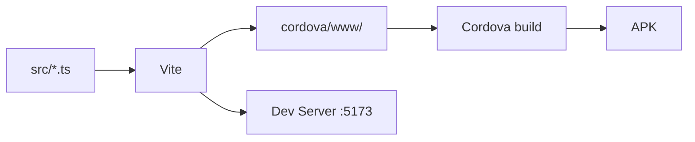

# 天下牌 - 项目初始化设计

## 概述

初始化「天下牌」2D跨平台卡牌游戏的 Cordova 项目，集成 Phaser 4 作为游戏框架，使用 TypeScript + Vite 构建工具链，实现古风中国风开始菜单。

## 目标平台

- Android (Cordova)
- Web (Vite dev server / 静态部署)

## 技术栈

| 层级 | 技术 |
|------|------|
| 跨平台壳 | Cordova |
| 游戏引擎 | Phaser 4 |
| 语言 | TypeScript (ES6+) |
| 构建工具 | Vite |
| 包管理 | npm |

## 项目结构

```
UnderTheHeaven/
├── cordova/              # Cordova 项目目录
│   ├── config.xml        # Cordova 配置
│   └── www/              # 构建输出目标（gitignore）
├── src/
│   ├── main.ts           # 入口：创建 Phaser.Game 实例
│   ├── config.ts         # GameConfig（分辨率、缩放、场景列表）
│   └── scenes/
│       └── MenuScene.ts  # 开始菜单场景
├── public/
│   └── assets/           # 静态资源（后续放入图片、字体等）
├── index.html            # 入口 HTML
├── vite.config.ts        # Vite 配置（build.outDir → cordova/www）
├── tsconfig.json         # TypeScript 配置
└── package.json          # 依赖和脚本
```

## 构建流水线



**npm scripts:**

- `dev` — vite dev server，浏览器开发
- `build` — vite build，输出到 cordova/www
- `android` — cordova run android
- `build:android` — vite build && cordova build android

## 游戏架构

### Phaser 4 GameConfig

- 分辨率：1280 × 720（16:9 横屏）
- 缩放模式：FIT（适配不同屏幕）
- 场景列表：`[MenuScene]`
- 渲染器：WebGL（优先）/ Canvas（回退）

### 场景设计

#### MenuScene（开始菜单）

**视觉设计（古风中国风）：**
- 背景：纯色深色调（#1a0a00 或类似深棕），模拟古代宣纸/绢帛氛围
- 标题：使用 Phaser 的 Text 对象，显示「天下牌」

**交互元素：**
- 「开始游戏」按钮 → 点击后 scene.start('GameScene')（后续实现）
- 「继续游戏」按钮（灰色/禁用态）
- 「设置」按钮

**交互反馈：**
- 按钮 hover 变色
- 按钮点击缩放动画

## 后续扩展

- GameScene（对战场景）
- DeckScene（牌组编辑）
- ShopScene（商店）

## Cordova 配置

- 包名：com.undertheheaven.game
- 应用名：天下牌
- 目标 SDK：Android API 30+
- 屏幕方向：landscape（横屏）
